# KrishiRakshak — Implementation Diagrams

> **10 AWS Services** | **8 Features** | **3 Lambda Functions** | **17+ RAG Documents**

---

## 1. System Architecture (High-Level)

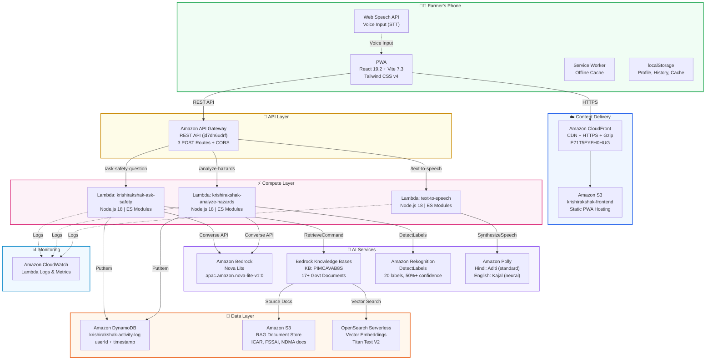

---

## 2. AWS Services Map (10 Total)

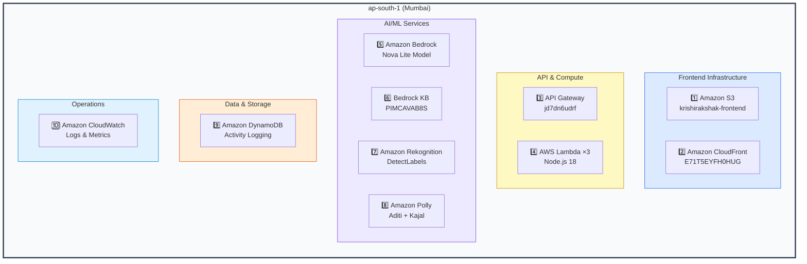

---

## 3. Frontend Component Tree

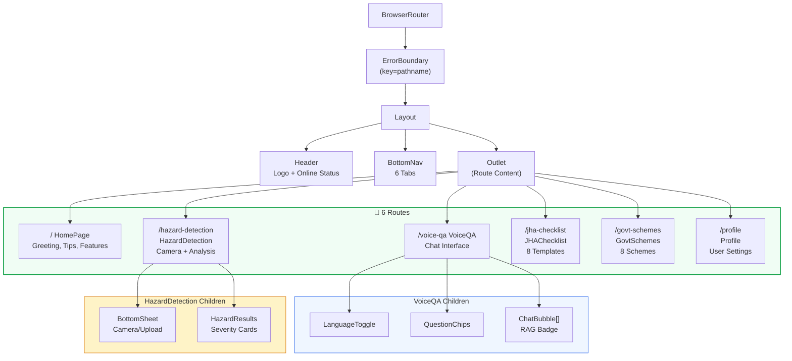

---

## 4. Feature Data Flows

### 4a. Voice Safety Q&A (RAG-Powered)

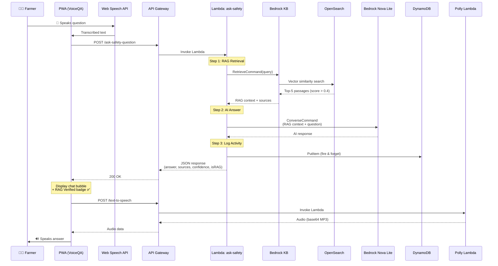

### 4b. Hazard Detection (Vision AI)

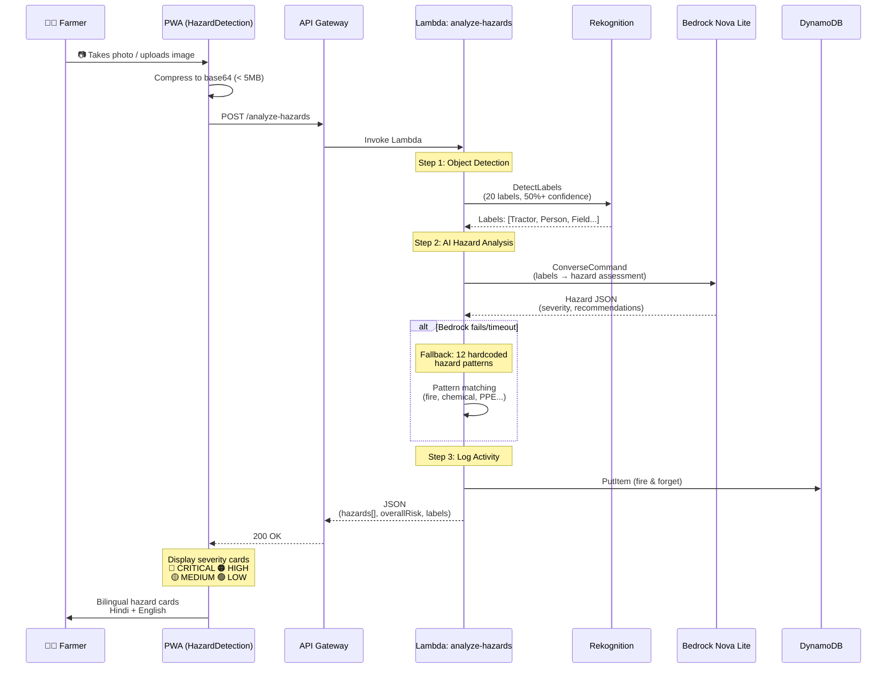

### 4c. Text-to-Speech (Amazon Polly)

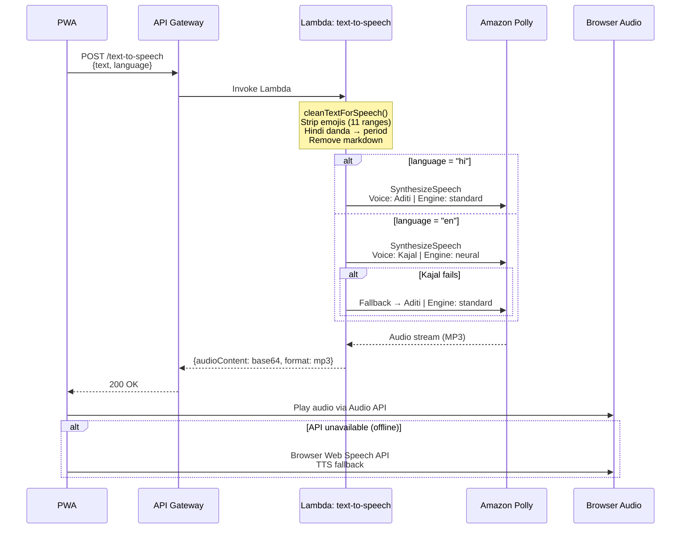

---

## 5. JHA Safety Checklists (8 Templates)

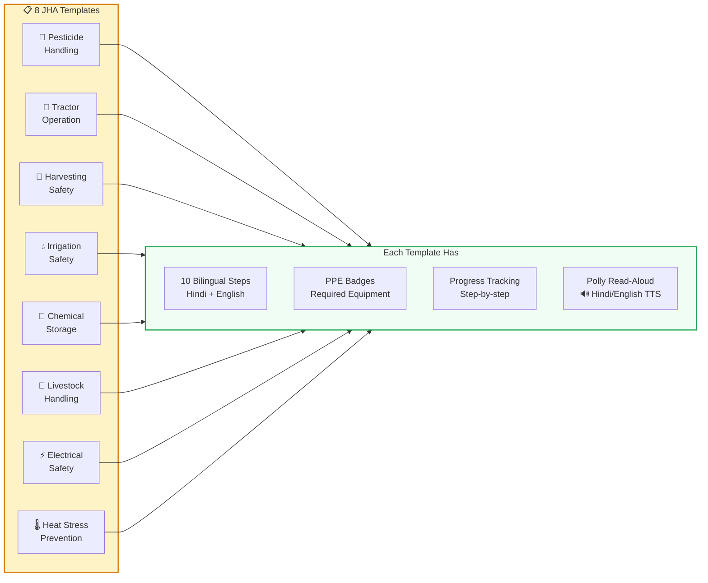

---

## 6. Government Schemes (8 Schemes)

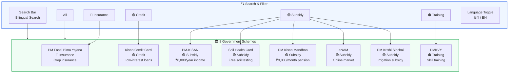

---

## 7. Data Storage Architecture

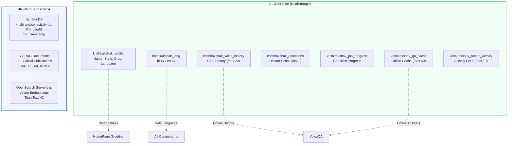

---

## 8. Deployment Architecture

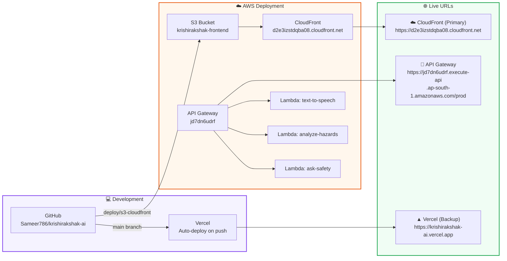

---

## 9. RAG Pipeline Detail

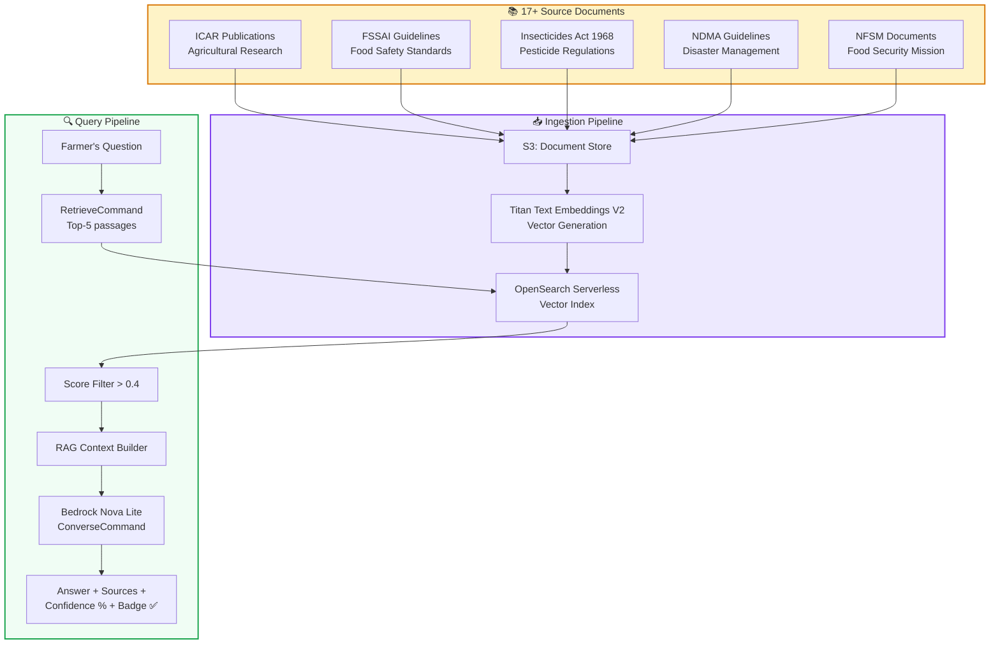

---

## 10. API Gateway Routes

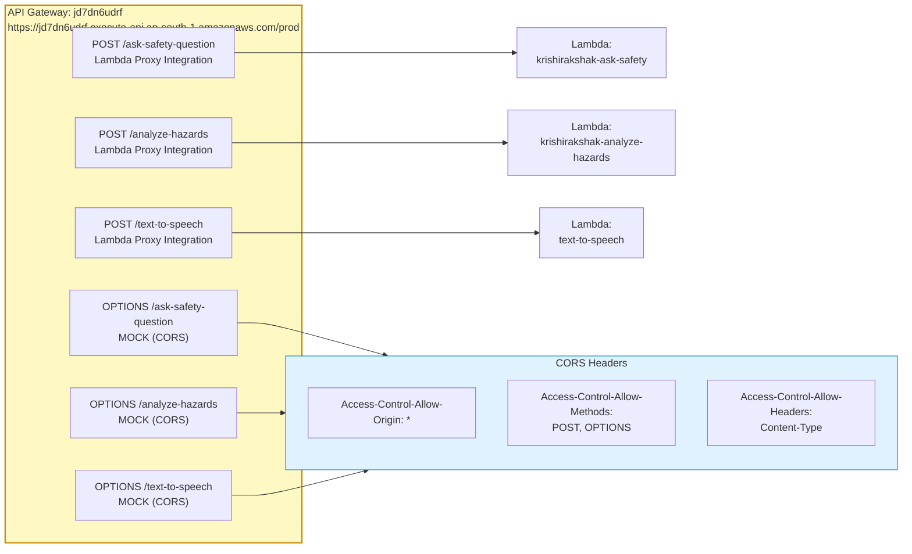

---

## 11. Offline & PWA Strategy

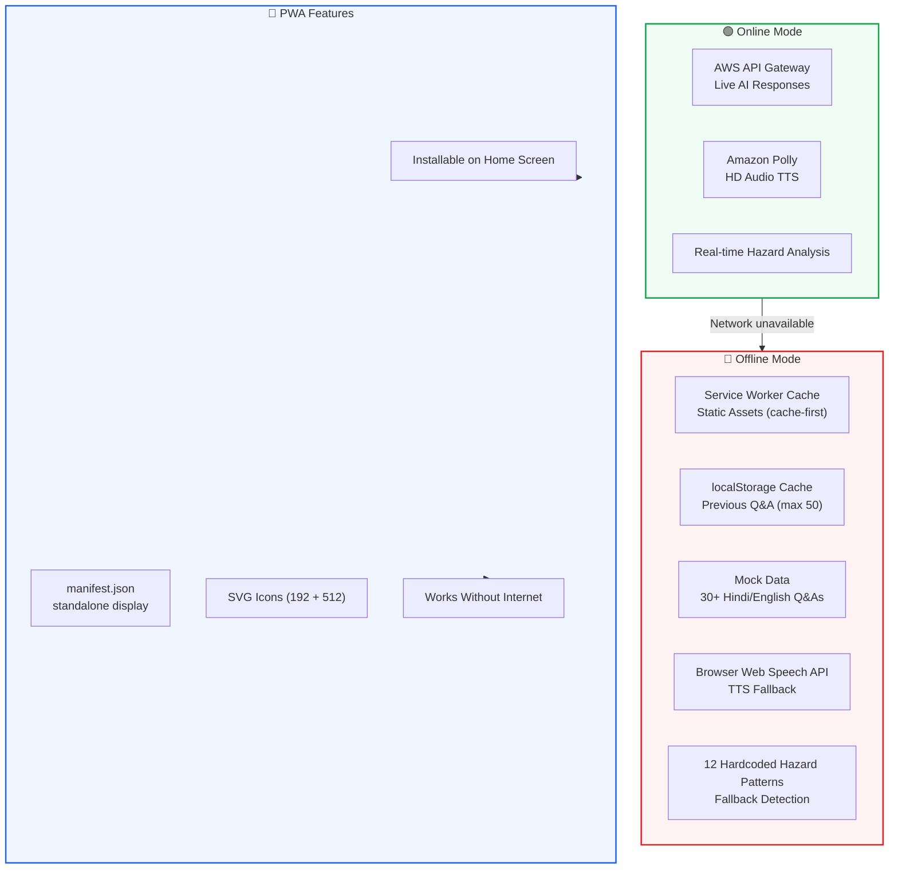

---

## 12. User Profile & Personalization Flow

```mermaid
graph LR
    subgraph PROFILE["👤 Profile Page"]
        NM["Name"]
        ST["State (10 options)"]
        DT["District"]
        CR["Primary Crop (10 options)"]
        FS["Farm Size"]
        LG["Language Preference"]
    end

    subgraph STORAGE["💾 localStorage"]
        KP["krishirakshak_profile"]
        KL["krishirakshak_lang"]
    end

    subgraph PERSONALIZE["🎯 Personalization"]
        GR["Homepage Greeting<br/>नमस्ते {Name}!"]
        TIP["Crop-Specific Safety Tips<br/>गेहूं किसानों के लिए"]
        LANG["All Pages Language<br/>हिंदी / English"]
    end

    PROFILE -->|Save| STORAGE
    STORAGE -->|Read| PERSONALIZE

    style PROFILE fill:#ede9fe,stroke:#7c3aed,stroke-width:2px
    style STORAGE fill:#fef3c7,stroke:#d97706,stroke-width:2px
    style PERSONALIZE fill:#f0fdf4,stroke:#16a34a,stroke-width:2px
```

---

## Summary

| Metric | Value |
|--------|-------|
| **AWS Services** | 10 (Bedrock, KB, Rekognition, Lambda, API GW, S3, DynamoDB, CloudWatch, CloudFront, Polly) |
| **Lambda Functions** | 3 (ask-safety, analyze-hazards, text-to-speech) |
| **API Routes** | 3 POST + 3 OPTIONS (CORS) |
| **Frontend Routes** | 6 pages |
| **JHA Templates** | 8 safety checklists (10 steps each) |
| **Govt Schemes** | 8 real Indian schemes |
| **RAG Documents** | 17+ official publications |
| **Languages** | 2 (Hindi + English) |
| **Deployment** | CloudFront (primary) + Vercel (backup) |
| **Region** | ap-south-1 (Mumbai) |

---

*Built for the **AWS AI for Bharat Hackathon** by Team KrishiRakshak*
